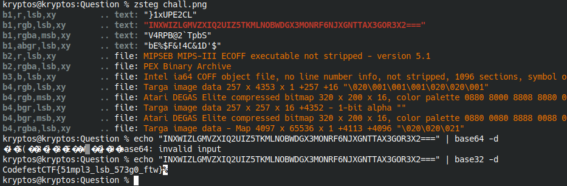

## Description

If DogeCoin had a counterfeit, this is probably it. Looks same but maybe isn't...

## Writeup

After some testing, ran zsteg and found it has LSB steganography. Got a base64 looking string (which was actually base32)

```bash
zsteg chall.png
```

```bash
echo 'INXWIZLGMVZXIQ2UIZ5TKMLNOBWDGX3MONRF6NJXGNTTAX3GOR3X2===' | base32 -d
```

## Flag

`CodefestCTF{51mpl3_lsb_573g0_ftw}`


